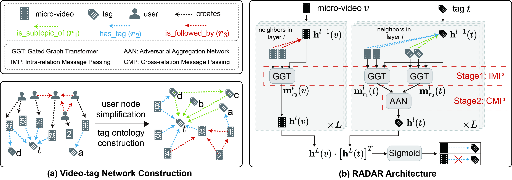

# RADAR

Implementation of paper ``Micro-video Tagging via Jointly Modeling Social Influence and Tag Relation`` ([paper PDF](https://arxiv.org/pdf/2303.08318.pdf)).

In this paper, we study the problem of micro-video tagging, formulated as a link prediction problem in a video-tag network to jointly model social influence and tag relation. Our RADAR model derive a better video and tag representation through Behavior Spread modeling and visual and linguistic knowledge aggregation. Extensive experiments on industrial datasets of three verticals verify the superiority of our model compared with several state-of-the-art baselines.

# Framework


# Datasets
The dataset can be downloaded [here](https://pan.baidu.com/s/1QHFA1lqw0i4GJWv6kES1Jg?pwd=85rv) (password: 85rv)

# Prerequisites
See [Installation Guide](install.md) for details.

# Quick Start
a. To reproduce Table 2 in paper.
```bash
bash benchmark/vanilla.sh # Vanilla
bash benchmark/mlgcn.sh # ML-GCN
bash benchmark/nextvlad.sh # NeXtVLAD
bash benchmark/cma.sh # CMA
bash benchmark/mall.sh # MALL-CNN
bash benchmark/taggnn.sh # TagGNN
bash benchmark/taghan.sh # HAN
bash benchmark/taghgt.sh # HGT
bash benchmark/simple_hgn.sh # Simple_HGN
bash benchmark/ourgnn.sh # Ours
```

b. To reproduce Table 3 in paper.
```bash
# 5.5.1 Ablation of different relations.
bash benchmark/ourgnn_relation_ablation.sh
# 5.5.2 Ablation of GGT.
bash benchmark/ourgnn_ggt_ablation.sh
# 5.5.3 Ablation of AAN.
bash benchmark/ourgnn_aan_ablation.sh
```

c. To reproduce Figure 7 in paper.
```bash
bash benchmark/ourgnn_layer_ablation.sh # (a)
python benchmark/ours_aan_sensi.py # (b)
```
